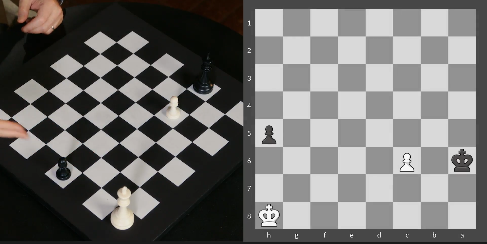
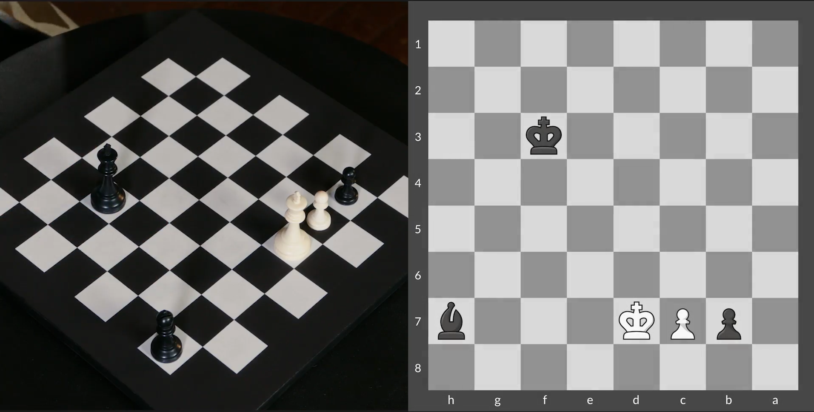
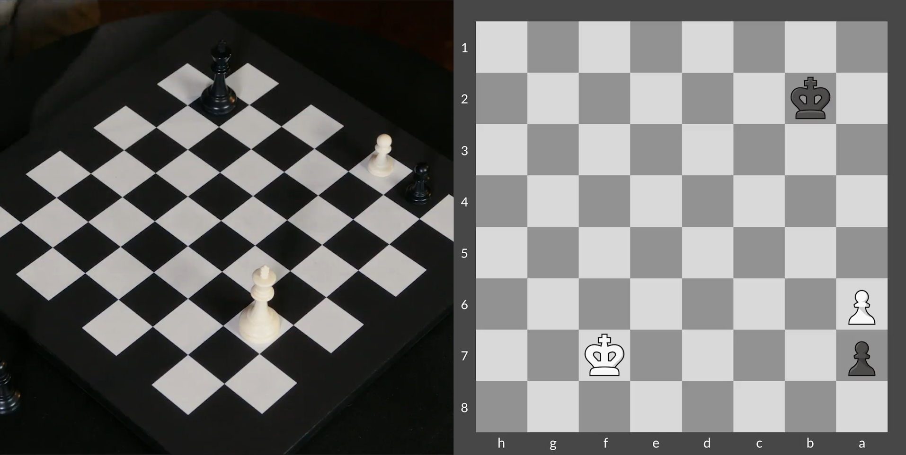
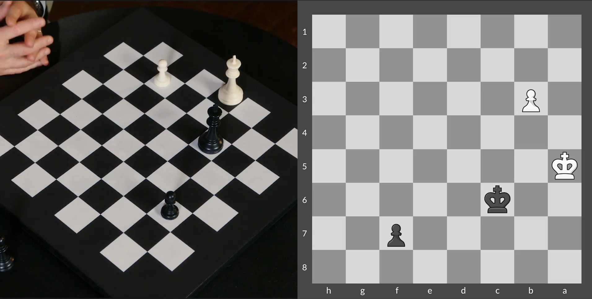
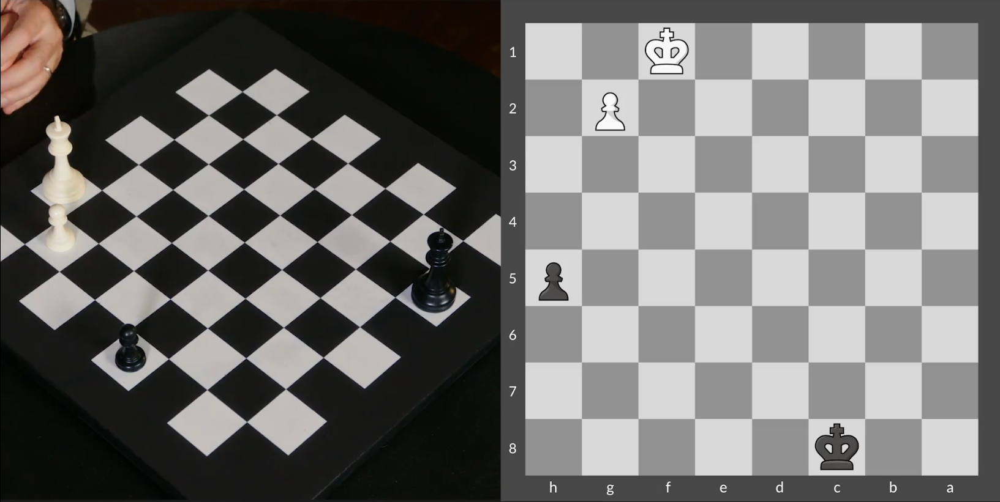
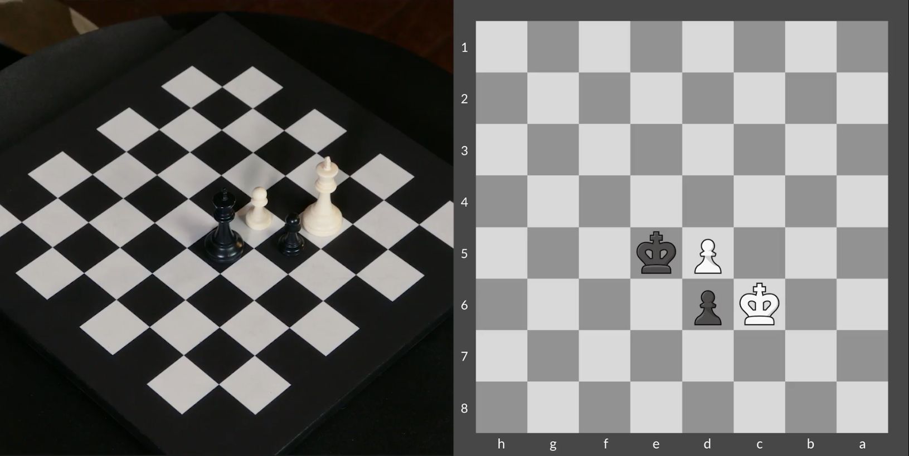
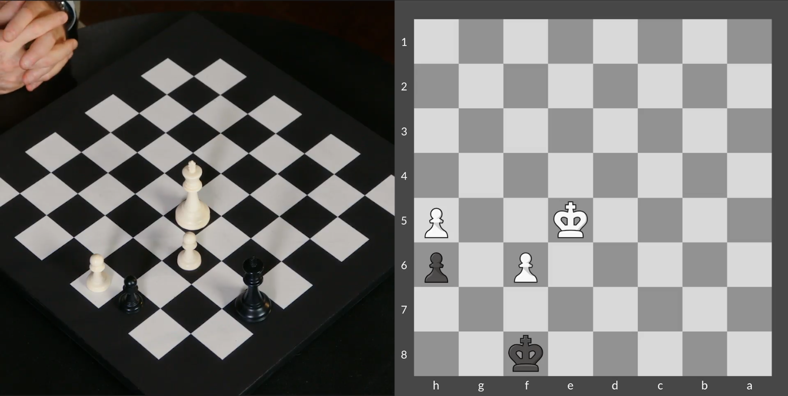

## Reti (1921)



FEN:

```
7K/8/k1P5/7p/8/8/8/8 w - - 0 1
```

## Drama in the Endgame



FEN:

```
8/1pPK3b/8/8/8/5k2/8/8 w - - 0 1
```

## Shouldering



FEN:

```
8/p4K2/P7/8/8/8/1k6/8 w - - 0 1
```

## Precision of Endgames



FEN:

```
8/5p2/2k5/K7/8/1P6/8/8 w - - 0 1
```

## Opposition



FEN:

```
2k5/8/8/7p/8/8/6P1/5K2 w - - 0 1
```

## Zugzwang

```
(!) When you are in a position that any move you make is worse for you. In pawn and king endgames when can often face mutual Zugzwangs.
```



FEN:

```
8/8/2Kp4/3Pk3/8/8/8/8 w - - 0 1
```

## Zugzwang and Stalemate



FEN:

```
5k2/8/5P1p/4K2P/8/8/8/8 w - - 0 1
```

