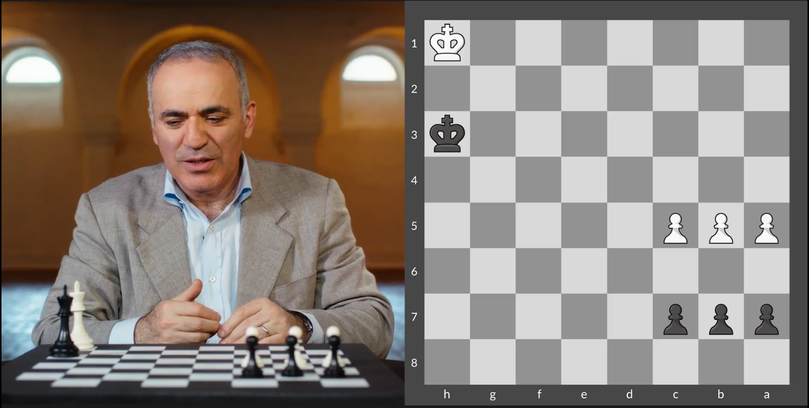
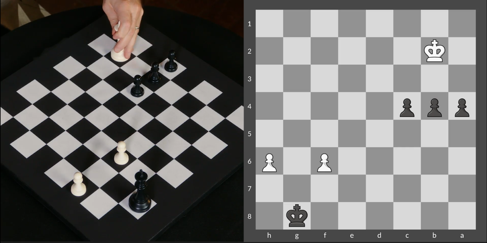
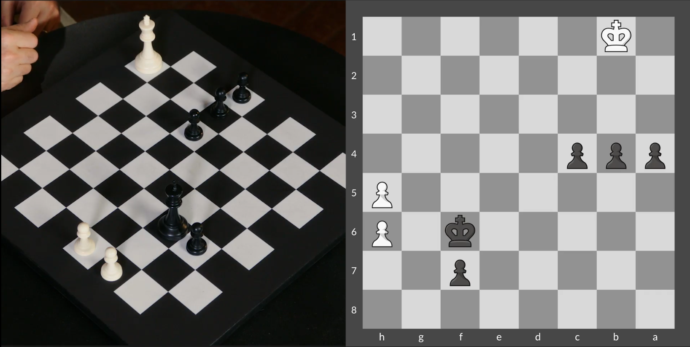
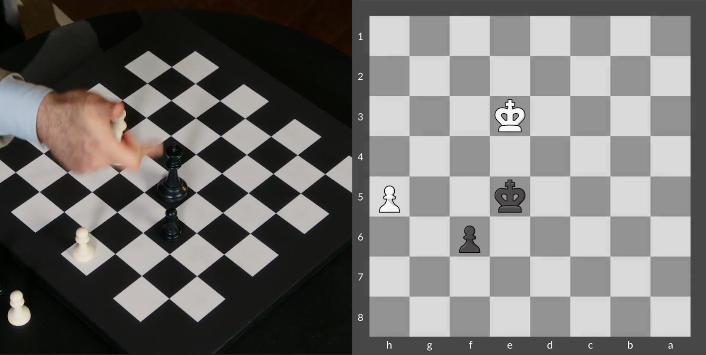
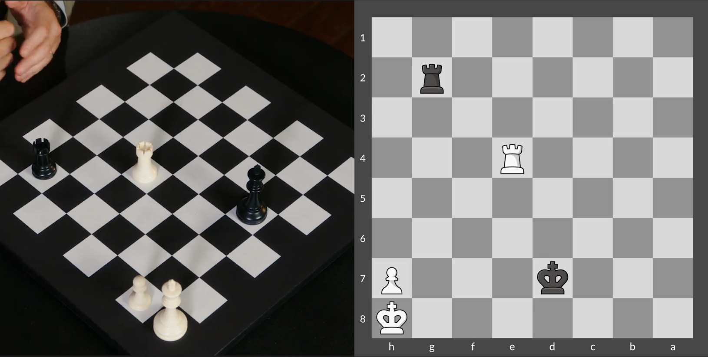
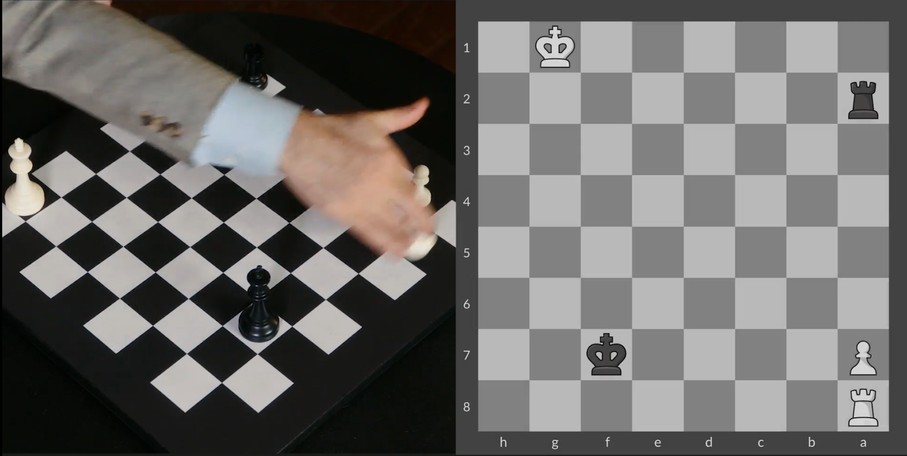
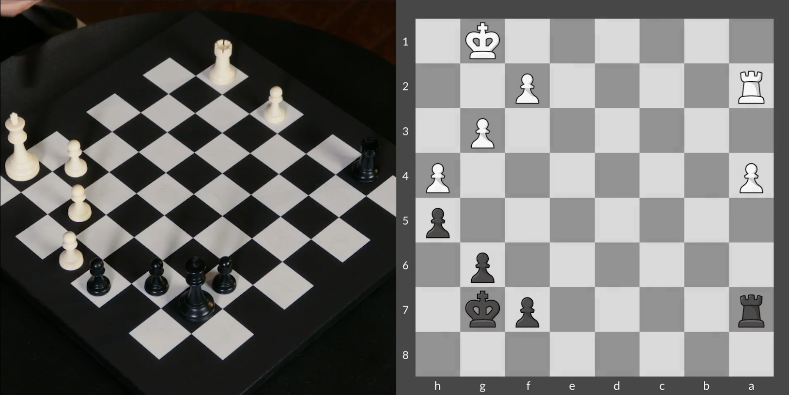

## Tactical Elements in Pawn Endgames



FEN:

```
8/ppp5/8/PPP5/8/7k/8/7K w - - 0 1
```

Position II



FEN:

```
6k1/8/5P1P/8/ppp5/8/1K6/8 w - - 0 1
```


Position III



FEN:

```
8/5p2/5k1P/7P/ppp5/8/8/1K6 w - - 0 1
```


Position IV



FEN:

```
8/8/5p2/4k2P/8/4K3/8/8 w - - 0 1
```


## Rook Endgames


FEN:

```
6K1/3k2P1/8/8/8/8/4R3/7r w - - 0 1
```


Position II



FEN:

```
6K1/3k3P/8/8/4R3/8/6r1/8 w - - 0 1
```


Position III



FEN:

```
R7/5k2/P7/8/8/8/r7/6K1 w - - 0 1
```


Position IV



FEN:

```
8/r4pk1/6p1/7p/P6P/6P1/R4P2/6K1 w - - 0 1
```

