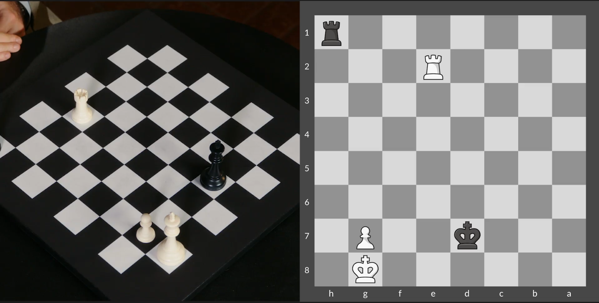
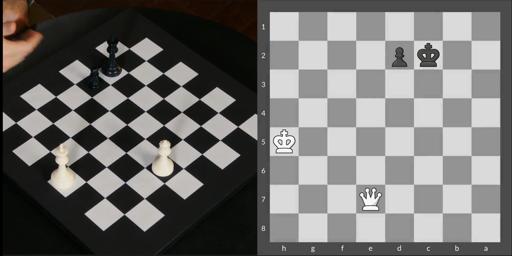
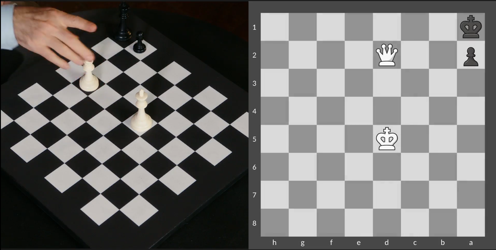
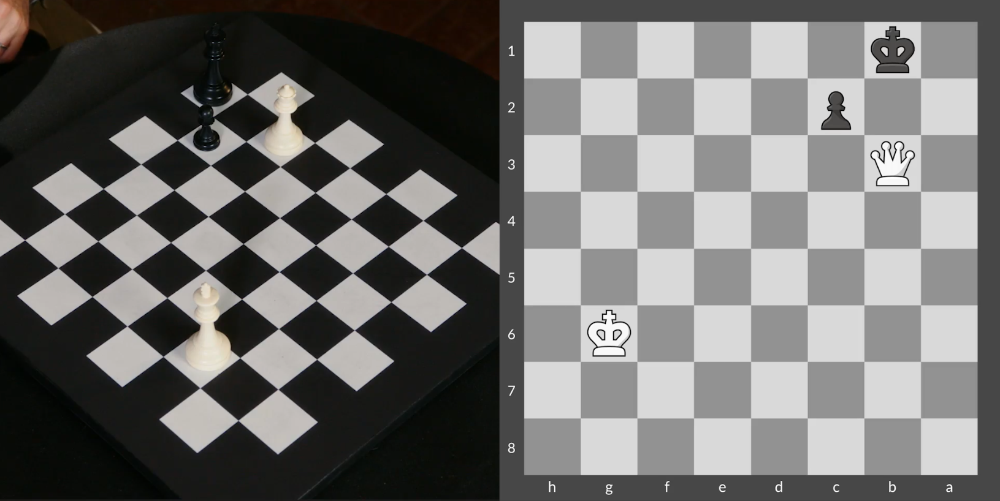
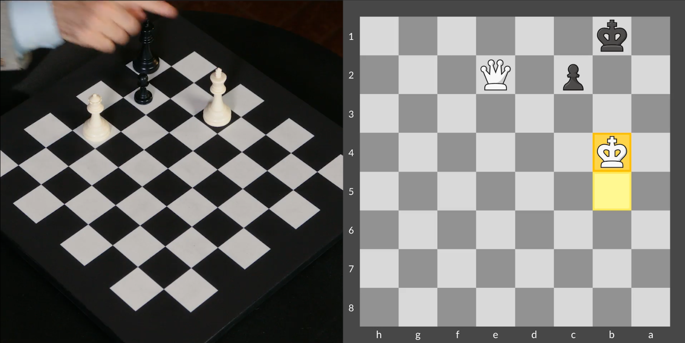

## Tactical Elements in Pawn Endgames


FEN:

```
8/ppp5/8/PPP5/8/7k/8/7K w - - 0 1
```

Position II


FEN:

```
6k1/8/5P1P/8/ppp5/8/1K6/8 w - - 0 1
```


Position III


FEN:

```
8/5p2/5k1P/7P/ppp5/8/8/1K6 w - - 0 1
```


Position IV


FEN:

```
8/8/5p2/4k2P/8/4K3/8/8 w - - 0 1
```


## Rook Endgames



FEN:

```
6K1/3k2P1/8/8/8/8/4R3/7r w - - 0 1
```


Position II


FEN:

```
6K1/3k3P/8/8/4R3/8/6r1/8 w - - 0 1
```


Position III


FEN:

```
R7/5k2/P7/8/8/8/r7/6K1 w - - 0 1
```


Position IV


FEN:

```
8/r4pk1/6p1/7p/P6P/6P1/R4P2/6K1 w - - 0 1
```


## Queen versus Pawn

Position I



FEN:

```
8/4Q3/8/7K/8/8/2kp4/8 w - - 0 1
```

Position II



FEN:

```
8/8/8/3K4/8/8/p2Q4/k7 w - - 0 1
```

Position III


(Ka1 and Qxc2 is a stalmate)

FEN:

```
8/8/6K1/8/8/1Q6/2p5/1k6 w - - 0 1
```

Position VI



FEN:

```
8/8/6K1/8/8/1Q6/2p5/1k6 w - - 0 1
```

## Role of the King

Advice to activate the King in endgames. Bring it to the middle of the board when Queens and Rooks are out. Either to win the game or to save it.