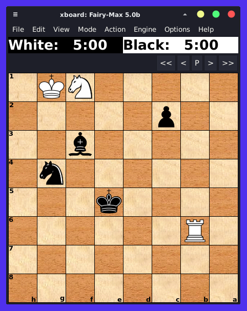

# kasparov-notes
Note taking of the Kasparov Teaches Chess Master Class (video not included on this repo).

Find FEN files attached in `./assets/fen-files`

You can load FEN files into any chess engine board software such as [xboard](https://www.gnu.org/software/xboard/) on GNU/Linux as seen below: 

You can also use chess web apps like [Lichess](https://liches.org) or [Chess.com](https://chess.com), just paste the FEN text within your browser.