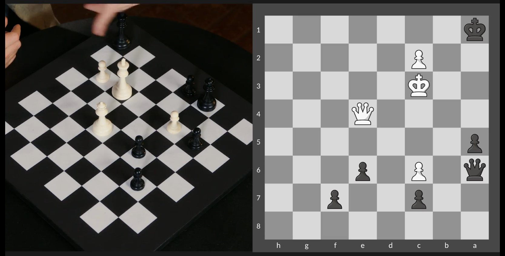

Kasparov vs Adams (1999)


FEN:

```
r3r1k1/2p2ppp/8/pnP5/8/5P2/P3qBPP/R2R2K1 w - - 0 1
```

## Winning Trades in the Ending

Study I:


FEN:

```
8/8/8/5p2/8/3R4/P7/1k1K1N1r w - - 0 1
```

After the rook trade, the A pawn can't be stoped


## Queen's Endgame

Study II



FEN:

```
8/2p2p2/q1P1p3/p7/4Q3/2K5/2P5/k7 w - - 0 1
```

White has to force black's king into the escape of the queen.


Then black can force a trade and promote the pawn.


## Challenge: A Winning Trades Study


FEN:

```
8/8/1R6/4k3/6n1/5b2/2p5/5NK1 w - - 0 1
```

